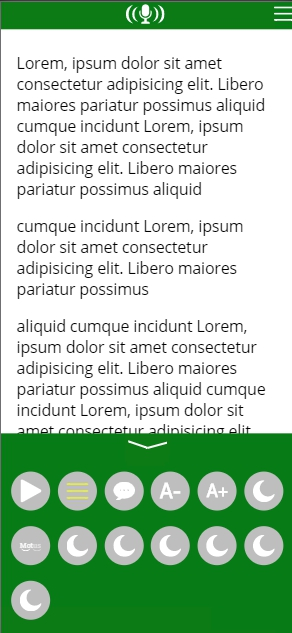

## FIL-A2-ihm

UX prototype implementing the [Web Speech API](https://developer.mozilla.org/en-US/docs/Web/API/Web_Speech_API/Using_the_Web_Speech_API).

On a command activation, the narrator will tell what was activated to help the user in his learning process.

When the micro icon is toggled at the top of the screen, the app listens continuously for commands (until it is deactivated). The narrator says which command was just used to confirm.

It targets keywords like `Activer`, `Active`, `Activation`, `Désactiver`, `Mode masque`, ... so saying the following should work:

 - `Activer mode masque`
 - `Activation du mode masque`
 - `Peux-tu activer le mode masque`
 - `J'aimerais que tu désactives le mode masque`
 - `L'émission Motus va commencer, il faut que tu t'actives !`

Supports:

 - Togglable commands (Mask mode, Motus, etc...), say `Activer mode masque`, `Désactiver mode masque`
 - One-tap commands (Adjust font size), say `Rétrécir texte`, `Agrandir texte`

## Demo

https://rigwild.github.io/FIL-A2-ihm/

## Screenshot



## License

```
           DO WHAT THE FUCK YOU WANT TO PUBLIC LICENSE
                   Version 2, December 2004
 
Copyright (C) 2020 rigwild <me@rigwild.dev>

Everyone is permitted to copy and distribute verbatim or modified
copies of this license document, and changing it is allowed as long
as the name is changed.
 
           DO WHAT THE FUCK YOU WANT TO PUBLIC LICENSE
  TERMS AND CONDITIONS FOR COPYING, DISTRIBUTION AND MODIFICATION

 0. You just DO WHAT THE FUCK YOU WANT TO.
```
